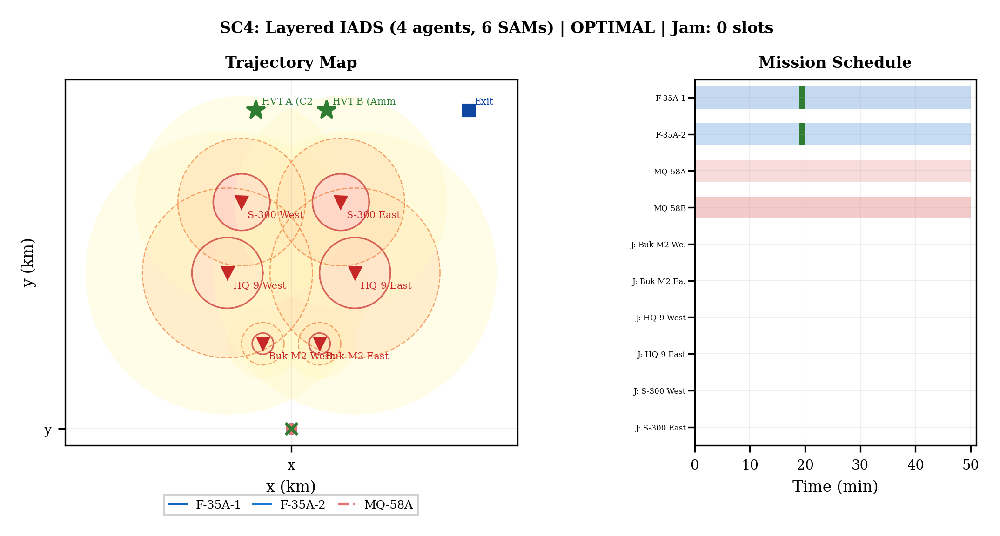

# Cooperative Mission Planner for Manned-Unmanned Teaming

A modular MILP/CP-SAT solver for cooperative multi-agent combat mission planning in contested airspace. Built for the loyal wingman paradigm: F-35A strike aircraft paired with MQ-58 collaborative combat aircraft (CCA) providing electronic warfare support against layered surface-to-air missile (SAM) defenses.

**Status:** All 6 validation scenarios solve to OR-Tools `OPTIMAL` with gaps <= 0.77% in 16-270 seconds. A 5-sector campaign demonstrator (14 agents, 22 SAMs, 1500 km theater) solves all-OPTIMAL in under 9 minutes.


*SC4: Layered IADS scenario. Two F-35As and one MQ-58 jammer navigate a 6-SAM layered defense to strike two high-value targets. Solved OPTIMAL, 0.00% gap, 270s.*

---

## Problem

Plan cooperative air strike missions where:
- **F-35A** strikers must ingress through SAM threat rings, deliver weapons on assigned targets, and egress to a safe exit point
- **MQ-58** jammers must escort strikers by suppressing SAM fire-control radars from within a computed jam-range envelope
- Jamming, strike, and egress must be **temporally coupled** -- the jammer must be active on the correct SAM at the exact slot the striker passes through its engagement zone
- All agents must satisfy speed limits, fuel budgets, turn-rate physics, and weapon standoff constraints simultaneously

This is **not** a vehicle routing problem. The temporal coupling between electronic attack and kinematic trajectory, combined with disjunctive SAM avoidance over layered threat geometries, makes the problem NP-hard even for two agents.

---

## Architecture

### Solver Pipeline

```
Scenario Config
      |
[L0] Payload Advisor ---- burn-through range, J/S feasibility (1.9 ms)
      |
[L1] Fleet Divider ------ greedy threat-to-team assignment
      |
[L2] DAG Scheduler ------ wave ordering via Kahn's algorithm (0.02 ms)
      |
[L3] Transfer Router ---- A* jammer repositioning between sectors (170 ms)
      |
[L4] Trajectory Solver -- per-team CP-SAT with full constraint set
      |
   OPTIMAL trajectories + mission schedule + fuel report
```


*Hierarchical decomposition: payload advisory, fleet division, DAG scheduling, transfer routing, and per-team trajectory optimization.*

### Key Formulation Decisions

| Component | Approach | Why |
|-----------|----------|-----|
| **Speed model** | Octagonal (12:5:13 Pythagorean triple) | 7.6% error vs Euclidean, zero extra variables, LP-tight |
| **SAM avoidance** | 8-direction disjunction + jam escape | Unified threat avoidance and electronic attack in one constraint |
| **Objective** | Pk-weighted lexicographic (attrition >> time >> cost) | Dollar-valued attrition prevents trivial "fly around everything" solutions |
| **Jam model** | Per-SAM FCR escort jam | Each jammer targets specific SAM fire-control radars per slot |
| **Precompute** | 4-stage pipeline (audit, budget, reachability, fleet reduction) | 40-60% variable reduction before solver starts |

---

## Geometry

The solver uses an octagonal norm (inscribed 8-gon) for speed, distance, and exclusion zone constraints. This replaces the Manhattan (diamond) norm used in earlier versions, reducing geometric error from 41% to 7.6% with zero additional integer variables.


*Comparison of norm approximations. The octagon (green) closely tracks the Euclidean circle (black) using only linear constraints on existing absolute-value variables.*

---

## Threat Models

### SAM Engagement (Zarchan Model)

Kill probability is modeled as a continuous function of range, guidance quality, and countermeasures:

```
P_k(R) = P_k_max * c_stealth * c_jam * min(1, (R_lethal / R)^alpha)
```

where `alpha` encodes guidance quality (command-guided: 2, semi-active: 3, active: 4).


*Zarchan P_k(R) model showing stealth-only vs stealth+jam kill probability for S-300, S-400, HQ-9, and Buk-M2. Shaded regions indicate hard-kill (red), MEZ (yellow), and detection (green) zones.*

### Electronic Warfare

Jammer placement is constrained by:
- **Jam range envelope:** octagonal containment within effective J/S radius
- **Mainlobe half-plane:** jammer must be on the striker-approach side of the radar
- **Multi-beam AESA:** MQ-58 can simultaneously jam up to 3 SAMs

---

## Validation Results

### Scenario Suite (v6 Pipeline, Lexicographic Objective)

| Scenario | Fleet | SAMs | HVTs | Status | Gap | Time |
|----------|-------|------|------|--------|-----|------|
| SC1 -- Corridor Strike | 2x F-35A + MQ-58 | 3 | 2 | OPTIMAL | 0.77% | 120s |
| SC2 -- Flanking Maneuver | F-35A + 2x MQ-58 | 4 | 1 | OPTIMAL | 0.00% | 39s |
| SC3 -- SAM Wall | 2x F-35A + MQ-58 | 6 | 2 | OPTIMAL | 0.00% | 16s |
| SC4 -- Layered IADS | 2x F-35A + 2x MQ-58 | 6 | 2 | OPTIMAL | 0.00% | 270s |
| SC5 -- Dense IADS + S-400 | 3x F-35A + MQ-58 | 8 | 3 | OPTIMAL | 0.03% | 267s |
| SC6 -- HVT Inside SAM | 2x F-35A + MQ-58 | 3 | 2 | OPTIMAL | 0.01% | 154s |

SC6 is the only scenario where jamming activates (21 slots) -- all others use standoff weapons (JASSM-ER, 370+ km) to avoid the SAM engagement zone entirely. The precompute pipeline detects this in < 1 second.

### Constraint Ablation


*Cumulative optimality gap reduction on SC6. Each engineering improvement (octagon speed, IB SAM encoding, turn cap, two-phase solve, warm-start hints) reduces gap from 24.1% to 0.2%.*

### Campaign Demonstrator

A 5-sector, 3-wave campaign across a 1500 x 2000 km theater:

| Wave | Sector | Fleet | SAMs | Solve Time | Status |
|------|--------|-------|------|------------|--------|
| 1 | NW Corridor | 3 agents | 4 | 89s | OPTIMAL |
| 1 | NE Wall | 3 agents | 5 | 15s | OPTIMAL |
| 1 | W Flanking | 3 agents | 4 | 30s | OPTIMAL |
| 2 | C Layered IADS | 4 agents | 6 | 224s | OPTIMAL |
| 3 | SE Close Strike | 3 agents | 3 | 124s | OPTIMAL |

**Total: 14 agents, 22 SAMs, 5/5 OPTIMAL in 481 seconds.** MQ-58 jammers transfer between waves via A*-routed corridors (1039 km, 73 min + 750 km, 53 min).


*Five-sector campaign with threat rings, agent start positions, and strike assignments across a 1500 km theater.*

---

## Tech Stack

- **Solver:** Google OR-Tools CP-SAT (CDCL(T) lazy clause generation, 16-worker parallel search)
- **Language:** Python 3.11
- **Physics:** Custom models for radar detection (4th-root law), EW (J/S ratio), SAM engagement (Zarchan Pk), aerodynamic drag (parabolic polar + transonic correction), Breguet fuel consumption
- **Visualization:** Matplotlib tactical reports with mission schedule Gantt charts
- **Platform data:** 14 air platforms, 7 SAM/radar systems, 47 weapon variants

---

## Repository Structure

```
cooperative-mission-planner/
|-- README.md
|-- LICENSE
|-- .gitignore
|-- requirements.txt
|
|-- figures/                    # Curated showcase figures (paper-quality)
|   |-- sc4_layered_iads.png
|   |-- sc6_hvt_inside_sam.png
|   |-- campaign_map.png
|   |-- campaign_gantt.png
|   |-- xdsm_architecture.png
|   |-- octagon_geometry.png
|   |-- pk_model.png
|   |-- ablation_waterfall.png
|   +-- sc1_corridor_strike.png
|
|-- formulation/                # Mathematical formulation (cleaned excerpts)
|   |-- variables.md            # Decision variable catalog
|   |-- objective.md            # Lexicographic objective definition
|   |-- constraints.md          # Constraint summary table
|   +-- geometry.md             # Octagonal norm derivation
|
|-- scenarios/                  # Scenario definitions (sanitized configs)
|   |-- sc1_corridor_strike.py
|   |-- sc4_layered_iads.py
|   +-- sc6_hvt_inside_sam.py
|
|-- models/                     # Physics model excerpts
|   |-- radar_detection.py      # Fourth-root RCS-dependent detection
|   |-- sam_engagement.py       # Zarchan Pk(R) model
|   +-- ew_jamming.py           # J/S ratio and jam-range geometry
|
+-- docs/
    |-- solver_architecture.md  # Pipeline description
    +-- scenario_guide.md       # How to read the results
```

---

## Selected Publications

**Chou, P.-C.** (2026). *Cooperative Multi-Agent Combat Mission Planning via Constraint Programming: A Modular Solver for Manned-Unmanned Teaming Operations.* Manuscript in preparation.

---

## About

This project was developed as an independent research effort in combinatorial optimization for defense autonomy. The solver addresses a problem class that sits at the intersection of:

- **Operations research** -- mixed-integer programming with disjunctive constraints
- **Electronic warfare** -- J/S ratio modeling, mainlobe geometry, IADS suppression
- **Flight dynamics** -- speed/fuel/turn-rate physics for heterogeneous platforms
- **Multi-agent coordination** -- temporal coupling between cooperative roles

The full production solver, scenario suite, and paper are maintained in a private repository. This portfolio contains curated artifacts that demonstrate the technical approach and validated results.

---

## Contact

**Po-Chih Chou**
- Email: pcchouCR97@gmail.com
- University of Michigan: pcchou@umich.edu

---

*Built with Google OR-Tools CP-SAT. Platform data derived from open-source references (Jane's, GlobalSecurity, Wikipedia). No classified or export-controlled information is contained in this repository.*
